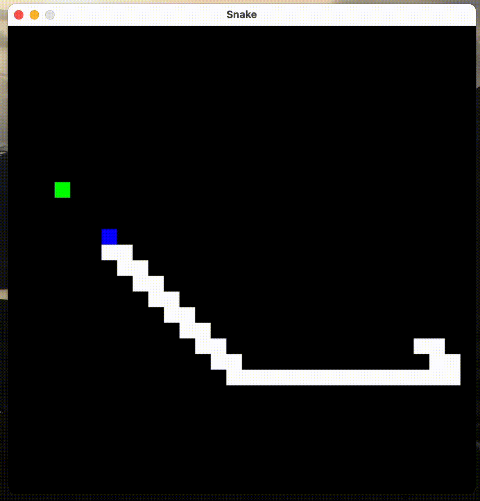

# Snake
Version of the classic Snake game using PyGame.



To setup:
```
virtualenv -p python3 .venv
source .venv/bin/activate
pip install -r requirmements.txt
```

To run:
```
python snake.py
```

## Game settings
- Move with WASD or 🔼◀️🔽▶️
- Pause the game with the spacebar
- Adjust the game speed with 1-9
- Let the game play itself in cheat mode with `c`
